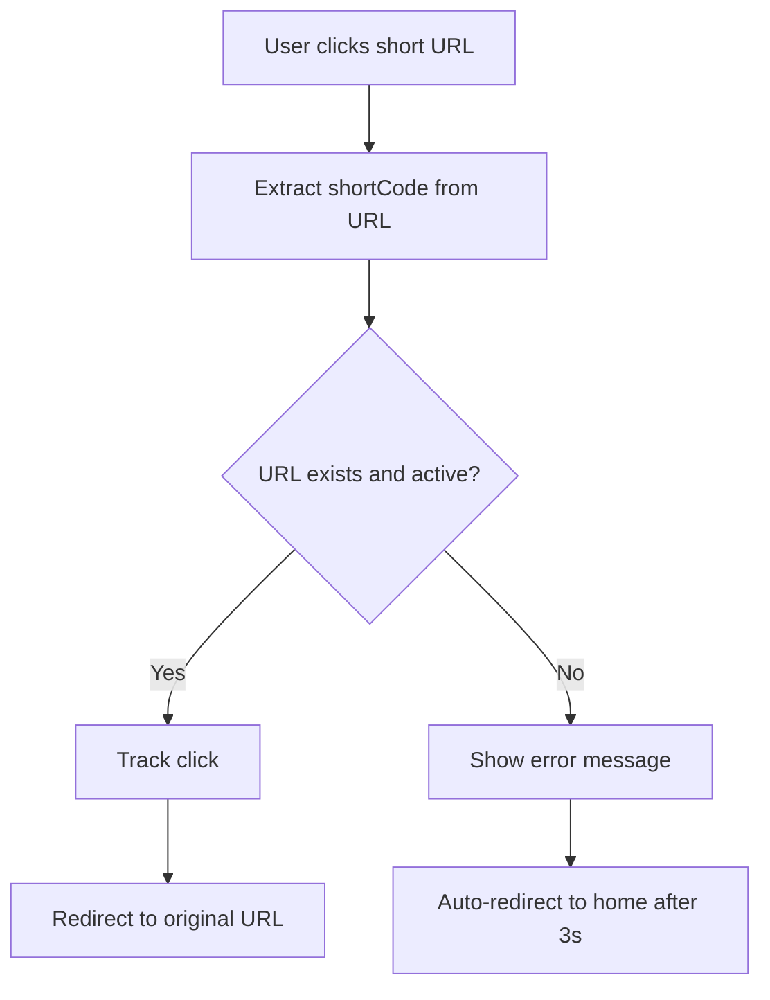

# URL Shortener - Design Document

## Table of Contents
1. [Overview](#overview)
2. [Architecture Overview](#architecture-overview)
3. [Technology Stack](#technology-stack)
4. [Data Modeling](#data-modeling)
5. [Client-Side Persistence Strategy](#client-side-persistence-strategy)
6. [Routing Strategy](#routing-strategy)
7. [Component Architecture](#component-architecture)
8. [State Management](#state-management)
9. [Logging Integration](#logging-integration)
10. [Performance Considerations](#performance-considerations)
11. [User Experience Design](#user-experience-design)
12. [Security Considerations](#security-considerations)
13. [Scalability & Maintainability](#scalability--maintainability)
14. [Assumptions & Constraints](#assumptions--constraints)
15. [Future Enhancements](#future-enhancements)

## Overview

The URL Shortener is a React-based single-page application that allows users to create shortened URLs with customizable expiry times and optional custom short codes. The application provides real-time analytics, click tracking with geolocation, and comprehensive logging integration.

### Key Features
- Create shortened URLs with custom expiry times (1 minute to 1 week)
- Optional custom short codes (3-10 alphanumeric characters)
- Real-time click tracking with geolocation
- Comprehensive statistics and analytics
- Client-side data persistence
- Responsive Material-UI design
- Integrated logging middleware

## Architecture Overview

The application follows a **layered architecture** with clear separation of concerns:

```
┌─────────────────────────────────────────┐
│               Presentation Layer         │
│  (React Components, Material-UI)        │
├─────────────────────────────────────────┤
│               Business Logic Layer       │
│  (Services, Validation, Utils)          │
├─────────────────────────────────────────┤
│               Data Access Layer          │
│  (LocalStorage, External APIs)          │
├─────────────────────────────────────────┤
│               Infrastructure Layer       │
│  (Logging, Routing, Error Handling)     │
└─────────────────────────────────────────┘
```

### Design Principles
- **Single Responsibility**: Each component has a clear, focused purpose
- **Separation of Concerns**: Business logic separated from UI components
- **Dependency Inversion**: Services are abstracted for easy testing/mocking
- **DRY (Don't Repeat Yourself)**: Reusable utilities and components
- **Fail-Safe**: Graceful error handling without breaking user experience

## Technology Stack

### Core Technologies

| Technology | Version | Justification |
|------------|---------|---------------|
| **React** | 19.1.0 | Modern, component-based architecture with excellent ecosystem |
| **TypeScript** | 4.9.5 | Type safety, better IDE support, reduced runtime errors |
| **Material-UI** | 7.1.2 | Consistent design system, accessibility, responsive components |
| **React Router** | 7.6.2 | Client-side routing for SPA navigation |

### Supporting Libraries

| Library | Purpose | Justification |
|---------|---------|---------------|
| **@mui/icons-material** | Icons | Consistent iconography with Material-UI |
| **@fontsource/roboto** | Typography | Professional, readable font family |
| **web-vitals** | Performance | Monitor core web vitals for optimization |

### Development Tools
- **Create React App**: Fast setup with sensible defaults
- **ESLint**: Code quality and consistency
- **Jest/Testing Library**: Unit and integration testing

## Data Modeling

### Core Data Structures

#### ShortenedUrl Interface
```typescript
interface ShortenedUrl {
  id: string;                    // Unique identifier
  originalUrl: string;           // The URL to redirect to
  shortCode: string;             // The short identifier (6 chars default)
  shortUrl: string;              // Full shortened URL
  validityPeriod: number;        // Validity in minutes
  expiryDate: Date;              // When the URL expires
  createdAt: Date;               // Creation timestamp
  clickCount: number;            // Total clicks
  clicks: ClickData[];           // Detailed click information
}
```

#### ClickData Interface
```typescript
interface ClickData {
  id: string;                    // Unique click identifier
  timestamp: Date;               // When the click occurred
  source: string;                // Referrer or "Direct access"
  userAgent?: string;            // Browser information
  location?: {                   // Geographic information
    country?: string;
    city?: string;
    region?: string;
  };
}
```

#### UrlStatistics Interface
```typescript
interface UrlStatistics {
  totalUrls: number;             // Total URLs created
  activeUrls: number;            // Non-expired URLs
  expiredUrls: number;           // Expired URLs
  totalClicks: number;           // Sum of all clicks
  averageClicksPerUrl: number;   // Average engagement
  mostClickedUrl?: ShortenedUrl; // Most popular URL
}
```

### Data Relationships
- One-to-Many: `ShortenedUrl` → `ClickData`
- Computed: `UrlStatistics` derived from `ShortenedUrl[]`

## Client-Side Persistence Strategy

### Storage Choice: LocalStorage
**Rationale**: 
- Persistent across browser sessions
- Synchronous API for simplicity
- 5-10MB storage limit sufficient for use case
- No server infrastructure required

### Data Management Pattern
```typescript
class UrlShortenerService {
  private readonly STORAGE_KEY = 'shortened-urls';
  private shortenedUrls: ShortenedUrl[] = [];
  private usedShortCodes: Set<string> = new Set();
  
  // Load data on initialization
  constructor() {
    this.loadFromStorage();
  }
  
  // Save after every mutation
  private saveToStorage(): void {
    localStorage.setItem(this.STORAGE_KEY, JSON.stringify(this.shortenedUrls));
  }
}
```

### Data Synchronization Strategy
- **Eager Loading**: Load all data on service initialization
- **Immediate Persistence**: Save after every create/update/delete operation
- **Memory Cache**: Keep working copy in memory for performance
- **Periodic Cleanup**: Remove expired URLs automatically

### Data Integrity Measures
- **Date Deserialization**: Convert string dates back to Date objects
- **Validation**: Ensure data structure integrity on load
- **Fallback**: Graceful handling of corrupted/missing data
- **Migration**: Version handling for future schema changes

## Routing Strategy

### Route Architecture
```typescript
// App-level routes
<Routes>
  <Route path="/" element={<UrlShortenerPage />} />
  <Route path="/statistics" element={<StatisticsPage />} />
  <Route path="/:shortCode" element={<RedirectHandler />} />
  <Route path="*" element={<Navigate to="/" replace />} />
</Routes>
```

### URL Handling Strategy

#### Short URL Resolution
1. **Pattern Matching**: `/:shortCode` captures any path parameter
2. **Validation**: Check if shortCode exists and is not expired
3. **Redirection**: Use `window.location.href` for external redirect
4. **Tracking**: Record click data before redirect
5. **Error Handling**: Graceful fallback for invalid/expired URLs

#### Redirect Flow


### Navigation Strategy
- **Declarative Routing**: Using React Router's Link components
- **Programmatic Navigation**: Using useNavigate hook for dynamic routing
- **State Preservation**: Maintain application state during navigation
- **SEO Friendly**: Semantic URLs with proper HTTP status codes

## Component Architecture

### Component Hierarchy
```
App
├── Layout
│   └── Navigation
├── UrlShortenerPage
│   ├── UrlForm
│   └── UrlResults
├── StatisticsPage
│   ├── StatisticsOverview
│   └── UrlList
│       └── UrlDetailCard
└── RedirectHandler
```

### Component Design Patterns

#### Container vs Presentational Components
- **Container Components**: Handle state and business logic (Pages)
- **Presentational Components**: Pure UI components (Form, Card, etc.)

#### Composition over Inheritance
- Small, focused components that can be composed
- Props interface for customization
- Children props for flexible layouts

#### Error Boundaries
- Graceful error handling at component level
- Prevent entire app crashes from component errors

### Component Communication
- **Props Down**: Data flows down through props
- **Events Up**: User interactions bubble up through callbacks
- **Context**: Shared state (if needed) through React Context
- **Service Layer**: Business logic abstracted to services

## State Management

### State Architecture
The application uses **local component state** with a **service layer** pattern:

```typescript
// Page-level state management
const [shortenedUrls, setShortenedUrls] = useState<ShortenedUrl[]>([]);
const [statistics, setStatistics] = useState<UrlStatistics>(...);

// Service as single source of truth
urlShortenerService.getShortenedUrls();
urlShortenerService.getStatistics();
```

### State Management Strategy
- **Local State**: Component-specific UI state (loading, errors, form data)
- **Service State**: Business data managed in service layer
- **Derived State**: Statistics computed from base data
- **Synchronization**: Regular polling for real-time updates

### State Flow
1. **User Action** → Component event handler
2. **Service Call** → Business logic execution
3. **State Update** → Component re-render
4. **Persistence** → Data saved to localStorage

## Logging Integration

### Logging Architecture
Custom logging middleware integrated throughout the application:

```typescript
// Centralized logging service
export const Log = async (
  stack: "frontend",
  level: "debug" | "info" | "warn" | "error" | "fatal",
  package: "api" | "component" | "hook" | "page" | "state" | "style",
  message: string
): Promise<void>
```

### Logging Strategy
- **Comprehensive Coverage**: Logs in all major components and services
- **Categorized Logging**: Different packages for different concerns
- **Error Context**: Rich error information with stack traces
- **User Interactions**: Track user behavior for analytics
- **Performance**: Non-blocking async logging

### Log Categories
- **API**: Service layer operations, data persistence
- **Component**: Component lifecycle, user interactions
- **Page**: Page navigation, major user flows
- **State**: State changes and data flow

## Performance Considerations

### Optimization Strategies

#### Bundle Optimization
- **Code Splitting**: Lazy loading for routes (future enhancement)
- **Tree Shaking**: Remove unused code
- **Asset Optimization**: Compressed images and fonts

#### Runtime Performance
- **Memoization**: React.memo for expensive components
- **Efficient Re-renders**: Proper dependency arrays in useEffect
- **Virtual Scrolling**: For large URL lists (future enhancement)

#### Data Performance
- **Lazy Loading**: Load data only when needed
- **Pagination**: For large datasets (future enhancement)
- **Caching**: In-memory caching with localStorage persistence

### Performance Monitoring
- **Web Vitals**: Track Core Web Vitals
- **Custom Metrics**: URL creation time, click tracking latency
- **Error Tracking**: Monitor and log performance issues

## User Experience Design

### Design Philosophy
- **Mobile-First**: Responsive design starting from mobile
- **Accessibility**: WCAG 2.1 AA compliance through Material-UI
- **Progressive Enhancement**: Works without JavaScript (basic functionality)
- **Intuitive Interface**: Clear visual hierarchy and user flows

### Key UX Features
- **Instant Feedback**: Loading states and success/error messages
- **Copy to Clipboard**: One-click URL copying
- **Visual Status**: Clear active/expired URL indication
- **Progressive Disclosure**: Advanced options hidden by default
- **Keyboard Navigation**: Full keyboard accessibility

### Responsive Design
- **Breakpoints**: xs (mobile), sm (tablet), md+ (desktop)
- **Grid System**: Material-UI's responsive grid
- **Touch Targets**: Minimum 44px touch targets for mobile
- **Typography**: Responsive font scaling

## Security Considerations

### Input Validation
- **URL Validation**: Proper URL format validation
- **Short Code Validation**: Alphanumeric characters only
- **XSS Prevention**: Proper escaping of user input
- **CSRF Protection**: Same-origin policy for API calls

### Data Security
- **Client-Side Only**: No sensitive data transmission
- **Local Storage**: Data stays on user's device
- **Input Sanitization**: Clean all user inputs
- **Error Handling**: No sensitive information in error messages

### Privacy
- **Geolocation**: User consent for location tracking
- **Analytics**: Anonymous usage tracking only
- **Data Retention**: Client-controlled data lifecycle

## Scalability & Maintainability

### Code Organization
```
src/
├── components/          # Reusable UI components
├── pages/              # Route-specific page components
├── services/           # Business logic and API calls
├── types/              # TypeScript type definitions
├── utils/              # Utility functions and helpers
└── hooks/              # Custom React hooks (future)
```

### Maintainability Features
- **TypeScript**: Strong typing for fewer runtime errors
- **Consistent Naming**: Clear, descriptive component and function names
- **Documentation**: JSDoc comments for complex functions
- **Testing**: Unit tests for critical business logic
- **Linting**: ESLint for code quality enforcement

### Scalability Considerations
- **Service Layer**: Easy to swap localStorage for API
- **Component Isolation**: Independent, reusable components
- **State Management**: Can easily migrate to Redux/Zustand if needed
- **API Integration**: Ready for backend integration

### Extension Points
- **Authentication**: User accounts and personal URLs
- **Analytics**: Enhanced tracking and reporting
- **Custom Domains**: Branded short URLs
- **Bulk Operations**: Import/export functionality

## Assumptions & Constraints

### Technical Assumptions
- **Modern Browsers**: ES6+ support, localStorage availability
- **JavaScript Enabled**: Core functionality requires JavaScript
- **Single User**: No multi-user or authentication requirements
- **Client-Side Only**: No backend server required

### Business Constraints
- **5 URL Limit**: Maximum 5 URLs per user
- **30-Minute Default**: Default expiry time
- **1 Week Maximum**: Maximum URL lifetime
- **Free Service**: No monetization features

### External Dependencies
- **Internet Connection**: Required for geolocation and logging
- **External APIs**: IP geolocation service availability
- **Logging Service**: Afformed test server availability

## Future Enhancements

### Technical Improvements
- **Offline Support**: Service Worker for offline functionality
- **Real-time Updates**: WebSocket for live statistics
- **Bulk Operations**: Import/export CSV functionality
- **API Integration**: Backend service integration
- **PWA Features**: Install prompt, background sync

### Feature Enhancements
- **QR Codes**: Generate QR codes for URLs
- **Custom Analytics**: Advanced click analytics
- **Link Preview**: Preview original URL content
- **Bulk Management**: Select and manage multiple URLs
- **Sharing**: Social media integration

### Performance Optimizations
- **Virtual Scrolling**: For large URL lists
- **Code Splitting**: Route-based code splitting
- **CDN Integration**: Asset delivery optimization
- **Caching Strategy**: Advanced caching mechanisms

---

## Conclusion

This URL Shortener application demonstrates modern React development practices with a focus on user experience, maintainability, and scalability. The architecture supports both current requirements and future enhancements while maintaining clean code organization and comprehensive error handling.

The design emphasizes:
- **User-Centric Design**: Intuitive interface with immediate feedback
- **Robust Architecture**: Separation of concerns and error handling
- **Performance**: Optimized for speed and responsiveness
- **Maintainability**: Clean code with comprehensive logging
- **Extensibility**: Ready for future feature additions

The application successfully balances simplicity with functionality, providing a solid foundation for a production-ready URL shortening service.
